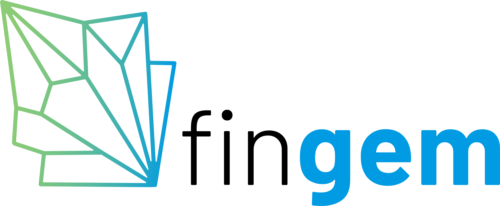
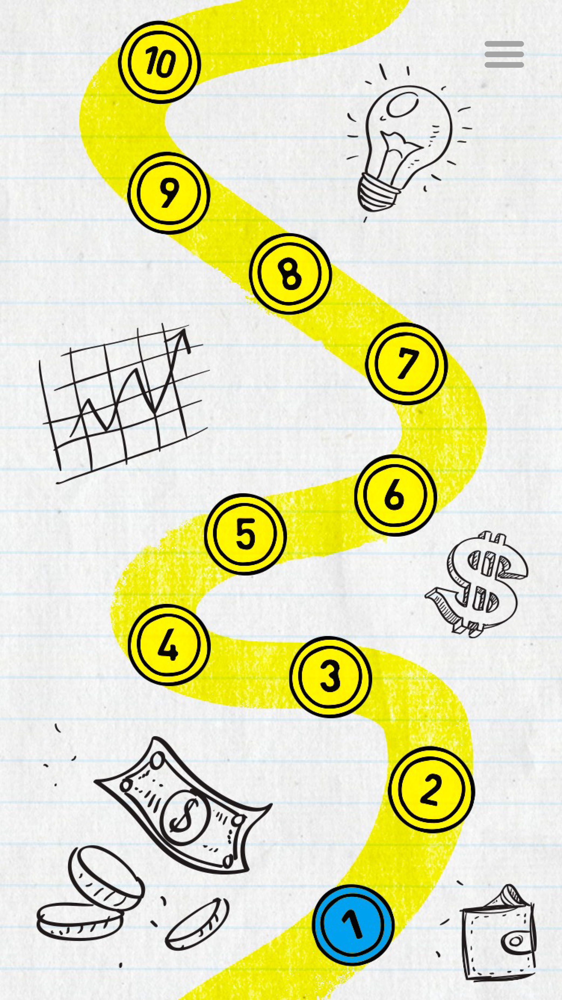

FinGem.io

An Edtech app with user tested UX/UI and user tested curriculum designed in a gamified platform for teens to learn financial literacy. This is at The beginning phase as I continue to learn React Native and continue adding to this complex app, while our web app finishes up development, It will allow us to troubleshoot better. 

Technologie's used: React Native, Javascript, Ruby on Rails, PostgreSQL

Getting Started: FinGem.io

Future Enhancements: 
Add login/ sign up features
Add better styling
Add Animation
Add Videos
Add more topics
Add higher levels
Add a separate login for teachers
Allow users to enter answers and have it stored in their account
Add quiz sections
Add leaderboard
Allow users to compete against each other

Screenshots:

